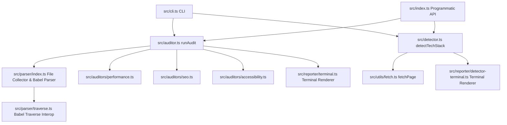

<p align="center">
  
</p>

<h1 align="center">UIAudit.js 🔍</h1>

<p align="center">
  <a href="https://www.npmjs.com/package/uiaudit.js"></a>
  <a href="https://www.npmjs.com/package/uiaudit.js"></a>
  <a href="LICENSE"></a>
</p>

`UIAudit.js` is a lightweight, high-performance, **AST-based static analysis engine** and CLI tool designed to audit React and Next.js components for Accessibility (a11y), Performance, and SEO issues. 

Unlike browser-driven auditing tools which require mounting components, running a browser instance, or rendering a full DOM, UIAudit parses component source files directly into an **Abstract Syntax Tree (AST)** using Babel. This allows it to identify issues **instantly during development**, in IDE plugins, or as a **blocking gate in your CI/CD pipeline** — without building or running your application.

### Why UIAudit?

- ⚡ **Zero-Runtime:** No browser, webpack, or build step needed
- 🎯 **60+ Accessibility Checks:** Full WCAG 2.1 Level A/AA/AAA compliance coverage
- 📊 **Performance & SEO Audits:** Detect React anti-patterns and crawlability issues
- 🚀 **Fast & Scalable:** Analyze thousands of components in seconds
- 🔗 **CI/CD Ready:** Non-zero exit codes for critical issues, JSON reports for automation
- 📦 **Published on npm:** Easy installation and updates via `npm install`

---

## Table of Contents
1. [Key Features](#key-features)
2. [Architecture Overview](#architecture-overview)
3. [Audit Categories & Rules](#audit-categories--rules)
   - [Accessibility (a11y)](#1-accessibility-a11y)
   - [Performance](#2-performance)
   - [SEO](#3-seo)
4. [Installation & Build](#installation--build)
5. [CLI Usage Guide](#cli-usage-guide)
   - [Audit Commands](#audit-commands)
   - [Shorthands](#shorthand-commands)
   - [CLI Options](#cli-options)
   - [Tech Stack Detection](#tech-stack-detection)
   - [CI/CD Integration](#cicd-integration)
6. [Programmatic API (SDK)](#programmatic-api-sdk)
7. [Scoring Methodology](#scoring-methodology)
8. [Extending & Contributing](#extending--contributing)
9. [License](#license)

---

## Key Features

*   **⚡ Zero-Runtime Static Analysis:** Scans `.js`, `.jsx`, `.ts`, and `.tsx` source files directly using static AST traversal. No webpack build or browser instantiation required.
*   **♿ 50+ Accessibility Checks:** Detailed checkers mapped to WCAG 2.1 guidelines (Level A/AA/AAA), catching keyboard traps, labeling failures, semantic errors, and more.
*   **📈 Performance Audits:** Identifies common React performance pitfalls like missing keys in lists, missing `useEffect` dependency arrays, and complex inline callbacks.
*   **🔍 Search Optimization (SEO):** Flags unlabelled anchors, non-semantic HTML structures, and raw images that bypass Next.js optimization.
*   **📡 Live Tech Stack Detection:** Discover frameworks, styling systems, tracking platforms, and hosting providers used on any live website URL.
*   **🎨 Premium Terminal UI:** Outputs beautifully formatted summary reports with color-coded scoreboards, file locations, issue impact (Critical, Major, Minor), failing code snippets, and drop-in code fixes.
*   **🤖 CI/CD Ready:** Returns exit code `1` if any **Critical** issues are found, letting you block commits or pipeline builds immediately.
*   **📦 Programmatic SDK:** Fully typed public exports for embedding in IDE extensions, pre-commit hooks, or build tools.

---

## Architecture Overview

The codebase is structured modularly to keep parsing, auditing, and reporting concerns separated:



### Core Components
*   **[src/index.ts](file:///run/media/onyx/New%20Volume/uiaudit/src/index.ts):** Exposes the public programmatic SDK and TypeScript typings.
*   **[src/types.ts](file:///run/media/onyx/New%20Volume/uiaudit/src/types.ts):** Defines data contracts for issues, category metrics, configuration options, and the final report.
*   **[src/auditor.ts](file:///run/media/onyx/New%20Volume/uiaudit/src/auditor.ts):** Orchestrates the overall audit, coordinates files, initiates audits, calculates scores, and aggregates results.
*   **[src/parser/](file:///run/media/onyx/New%20Volume/uiaudit/src/parser/):**
    *   `index.ts`: Collects all supported files recursively (excluding common build/node folders) and parses them to AST using Babel.
    *   `traverse.ts`: Solves CommonJS interop quirks for `@babel/traverse` to ensure compatibility across Node version runtimes.
*   **[src/auditors/](file:///run/media/onyx/New%20Volume/uiaudit/src/auditors/):**
    *   `accessibility.ts`: Implements 50+ WCAG 2.1 checks.
    *   `performance.ts`: Implements React-specific static performance validations.
    *   `seo.ts`: Evaluates crawlability, indexability, and structural semantics.
*   **[src/reporter/terminal.ts](file:///run/media/onyx/New%20Volume/uiaudit/src/reporter/terminal.ts):** Generates chalk-rendered scorecards, issue descriptions, code snippets, and interactive suggestions.

---

## Audit Categories & Rules

### Coverage

UIAudit includes **60+ accessibility rules**, **10+ performance checks**, and **8+ SEO validations**.

### 1. Accessibility (a11y)
Maps to **WCAG 2.1** success criteria (Level A/AA):
*   **Keyboard Operability:** Elements with click handlers (`onClick`) must also support key inputs (`onKeyDown`, etc.) and be keyboard-focusable via a valid `tabIndex`.
*   **Accessible Naming:** Elements like ``, `<button>`, `<a>`, `<iframe/>`, and interactive ARIA controls must possess descriptive names (via text children, `aria-label`, `aria-labelledby`, or `alt` tags).
*   **Form Association:** Form inputs (`<input>`, `<select>`, `<textarea>`) must be linked to a `<label>` (via `htmlFor` / `id` matching) or wrapped implicitly.
*   **Media Alternatives:** Checks if audio/video elements are missing captions (`track` tags).
*   **Structure & Page Rules:** Checks for page titles, skip-to-content links, responsive viewports, and valid heading structures.

### 2. Performance
Catches patterns that lead to memory leaks, redundant DOM mutations, or render cycles:
*   **Missing Key Props:** Lists rendered via `.map()` returning JSX elements without a stable, unique `key` prop.
*   **Unbound useEffects:** `useEffect` hooks called without a second argument (dependency array), causing them to execute on every single render.
*   **Leftover Debug Logs:** `console.log`, `console.info`, or `console.debug` references that leak data to the browser console.
*   **Complex Inline Callbacks:** Identifying large, multi-statement inline closures in React event handlers (like `onClick={() => { doA(); doB(); }}`) that invalidate child shallow-equality comparisons (`React.memo`).

### 3. SEO
Analyzes document structures to improve Google ranking and search bot crawling:
*   **Crawler Visibility:** Ensuring elements like images have alt text and anchors have descriptive, readable inner text (avoiding generic "Click here" or "Read more").
*   **Next.js Image Optimizations:** Recommends Next.js’s `<Image>` components instead of standard `` tags inside Next.js components to prevent Layout Shifts (CLS) and enable modern format conversion (WebP/AVIF).
*   **Document Outline Semantics:** Flags generic `<div>` tags carrying identifiers or class names that strongly indicate they should be semantic components (e.g., `<div className="navigation">` should be `<nav>`).

---

## Installation & Build

### Option 1: Install from npm (Recommended)

The easiest way to use UIAudit is to install it as a global or local npm package:

```bash
# Install globally (recommended for CLI usage)
npm install -g uiaudit.js

# Or install locally in your project
npm install --save-dev uiaudit.js
```

Once installed globally, you can use the `uiaudit` command directly:

```bash
uiaudit audit ./src
uiaudit a11y ./src/components
uiaudit perf ./src
uiaudit seo ./src
```

For local installation, prefix with `npx`:

```bash
npx uiaudit audit ./src
npx uiaudit a11y ./src/components
```

### Option 2: Clone & Build from Source

If you want to contribute or build from source:

#### Prerequisites
*   Node.js (v16.0.0 or higher)
*   npm (v7.0.0 or higher)

#### Setup
1.  Clone this repository to your local workspace:
    ```bash
    git clone https://github.com/yourusername/uiaudit.git
    cd uiaudit
    ```
2.  Install all dependencies:
    ```bash
    npm install
    ```
3.  Compile the TypeScript source files to JavaScript:
    ```bash
    npm run build
    ```
4.  Run the CLI:
    ```bash
    npm start -- audit ./src
    # Or directly with node
    node dist/cli.js audit ./src
    ```

---

## CLI Usage Guide

### Basic Usage

The main command is `audit`, which scans a directory recursively:

```bash
# Scan entire src directory (global installation)
uiaudit audit ./src

# Scan a specific component directory (global installation)
uiaudit audit ./src/components

# With npx (local installation)
npx uiaudit audit ./src
```

### Category-Specific Audits

Run audits for individual categories using shorthand commands:

```bash
# Accessibility audit only
uiaudit a11y ./src

# Performance audit only
uiaudit perf ./src

# SEO audit only
uiaudit seo ./src
```

### CLI Options & Flags

#### `-t, --type <categories>`
Specify which categories to audit (comma-separated). Defaults to all categories.

```bash
# Audit only accessibility and performance
uiaudit audit ./src --type accessibility,performance

# Audit only SEO
uiaudit audit ./src -t seo
```

#### `-o, --output <format>`
Change the output format. Options: `terminal` (default) or `json`.

```bash
# Output as JSON to stdout
uiaudit audit ./src --output json

# Output in terminal format (colorful with formatting)
uiaudit audit ./src -o terminal
```

#### `-f, --file <filepath>`
Save detailed JSON report to a file for further processing or archival.

```bash
# Save JSON report to file
uiaudit audit ./src -f ./reports/audit-report.json

# Combine with JSON output
uiaudit audit ./src --output json -f ./audit-results.json
```

### Complete CLI Examples

```bash
# Audit accessibility only with JSON output saved to file
uiaudit a11y ./src/components -f ./a11y-report.json

# Audit performance with detailed output
uiaudit perf ./src --output terminal

# Run all audits and save JSON report
uiaudit audit ./src -f ./full-audit.json

# Audit specific folder for accessibility
uiaudit audit ./src/pages --type accessibility
```

### Tech Stack Detection

Audit any live website URL to discover its active front-end frameworks, styling libraries, analytics tools, hosting providers, and utilities.

```bash
# Basic usage (prints a styled report to terminal)
uiaudit detect https://react.dev

# Save stack report to a JSON file
uiaudit detect https://react.dev -f stack-report.json

# Output as raw JSON to standard output
uiaudit detect https://react.dev --output json
```

#### Privacy & Confidentiality
> [!NOTE]
> The `detect` command only fetches and parses public-facing elements (like HTML structure, script tag paths, and HTTP response headers) that any standard browser gets when visiting the page. It **never** accesses or processes any private source directories, database credentials, server configuration secrets, or personal user data (PII).

### CI/CD Integration

UIAudit is designed to integrate seamlessly into your continuous integration pipeline. It returns a non-zero exit code (`1`) if any **Critical** issues are found, allowing you to fail builds or block commits.

#### npm scripts Integration

Add UIAudit to your `package.json` scripts:

```json
{
  "scripts": {
    "audit": "uiaudit audit ./src",
    "audit:a11y": "uiaudit a11y ./src",
    "audit:perf": "uiaudit perf ./src",
    "audit:seo": "uiaudit seo ./src",
    "pretest": "uiaudit audit ./src --type accessibility",
    "prebuild": "uiaudit audit ./src"
  }
}
```

#### GitHub Actions Example

```yaml
name: UI Audit

on: [pull_request, push]

jobs:
  audit:
    runs-on: ubuntu-latest
    steps:
      - uses: actions/checkout@v3
      
      - name: Setup Node.js
        uses: actions/setup-node@v3
        with:
          node-version: '18'
      
      - name: Install dependencies
        run: npm install
      
      - name: Run UI Audit
        run: npm run audit
        
      - name: Save audit report
        if: always()
        run: npx uiaudit audit ./src --output json -f audit-report.json
      
      - name: Upload report
        if: always()
        uses: actions/upload-artifact@v3
        with:
          name: audit-report
          path: audit-report.json
```

#### Pre-commit Hook

Use with `husky` to audit before commits:

```bash
# Install husky
npm install husky --save-dev
npx husky install

# Create pre-commit hook
npx husky add .husky/pre-commit "npx uiaudit audit ./src --type accessibility"
```

#### Exit Code & Fail Criteria

You can customize the pass/fail gate criteria using `--fail-on` and `--min-score`:

- **`--fail-on <critical|major|minor>`**: Set the minimum issue severity that causes a non-zero exit code (default: `critical`).
- **`--min-score <0-100>`**: Require a minimum overall score. Exits with code `1` if overall score drops below this threshold.

```bash
# Fail build if score is under 85 or if any major or critical issue exists
uiaudit audit ./src --fail-on major --min-score 85
```

---

## Local Configuration File (`uiaudit.config.json`)

UiAudit automatically looks for a configuration file in your project root (`uiaudit.config.json` or `.uiauditrc`). You can also specify a custom path with `-c, --config <path>`.

```json
{
  "categories": ["accessibility", "performance", "seo"],
  "ignore": [
    "node_modules/**",
    "dist/**",
    ".next/**",
    "build/**"
  ],
  "rules": {
    "img-missing-alt": "critical",
    "missing-key-prop": "major",
    "console-in-component": "off"
  },
  "failOn": "critical",
  "minScore": 80
}
```

---

## GitHub Action Integration

UiAudit can be used directly as a native GitHub Action in your workflows:

```yaml
name: UI Audit Gate

on: [push, pull_request]

jobs:
  audit:
    runs-on: ubuntu-latest
    steps:
      - uses: actions/checkout@v4
      - name: Run UiAudit Gate
        uses: Dheeraj-pilakkat/UiAudit.js@v2
        with:
          target: './src'
          categories: 'performance,seo,accessibility'
          fail-on: 'critical'
          min-score: 80
```

---

## VS Code Extension

UiAudit provides a real-time VS Code extension located in [`vscode-extension/`](file:///run/media/onyx/New%20Volume/uiaudit/vscode-extension).

### Features
- **Inline Diagnostics:** Underlines accessibility, performance, and SEO issues in real-time as you type or save `.tsx`, `.jsx`, `.ts`, and `.js` files.
- **Quick Fixes:** Instant code action suggestions to remediate issues.
- **Severity Mapping:**
  - Critical → 🔴 Red Error
  - Major → 🟡 Yellow Warning
  - Minor → 🔵 Blue Info

### Extension Commands
- `UiAudit: Scan Active File`
- `UiAudit: Clear Diagnostics`


# Check exit code
echo $?  # 0 = success, 1 = critical issues found
```

---

## Programmatic API (SDK)

You can import and execute the engine programmatically in your build scripts, custom tooling, IDE plug-ins, or test suites. UIAudit is available as both an npm package and source code.

### Installation for Programmatic Use

```bash
# Install as a dependency (not just dev dependency, since it runs at build time)
npm install uiaudit.js

# Or as a dev dependency for build/test automation
npm install --save-dev uiaudit.js
```

### Basic Usage Example

```typescript
import { runAudit } from 'uiaudit.js';
import type { AuditReport } from 'uiaudit.js';

const targetPath = './src/components';
const options = {
  types: ['accessibility', 'performance', 'seo']
};

try {
  const report: AuditReport = runAudit(targetPath, options);
  
  console.log(`Overall Score: ${report.overallScore}/100`);
  console.log(`Scanned ${report.totalFiles} components.`);
  console.log(`Total Issues Found: ${report.totalIssues}`);
  
  // Inspect category-specific results
  const perfResult = report.results.performance;
  if (perfResult) {
    console.log(`Performance Score: ${perfResult.score}`);
    console.log(`Issues: ${perfResult.issues.length}`);
  }

  // Iterate through all issues
  for (const issue of report.issues) {
    console.log(`[${issue.impact.toUpperCase()}] ${issue.title}`);
    console.log(`  File: ${issue.file}:${issue.line}`);
    console.log(`  Suggestion: ${issue.suggestion}`);
  }
} catch (error) {
  console.error("Audit failed:", error.message);
  process.exit(1);
}
```

### API Reference

#### `runAudit(targetPath: string, options?: AuditOptions): AuditReport`

Main entry point for running an audit.

**Parameters:**
- `targetPath` (string): Path to directory or file to audit (e.g., `'./src/components'`)
- `options` (AuditOptions, optional): Configuration object
  - `types`: Array of audit categories (`'accessibility' | 'performance' | 'seo'`). Default: all three
  - `exclude`: Array of glob patterns to exclude

**Returns:** `AuditReport` object containing:
- `overallScore`: Numeric score (0-100)
- `totalFiles`: Number of files scanned
- `totalIssues`: Total issue count across all categories
- `results`: Object with category-specific results
- `issues`: Flat array of all issues found

#### `detectTechStack(url: string): Promise<DetectionResult>`

Retrieve the technology stack signature of a live site URL.

**Parameters:**
- `url` (string): The public web address to query (e.g., `'https://react.dev'`).

**Returns:** A Promise that resolves to a `DetectionResult` object containing:
- `url`: The final URL fetched (after following redirects).
- `title`: The string content of the page's HTML `<title>` tag.
- `statusCode`: The final HTTP status code.
- `technologies`: An array of `TechMatch` objects, each with `name`, `category`, `confidence`, and `evidence`.
- `headers`: A record containing the raw HTTP response headers returned by the server.

### Advanced Usage: Build Tool Integration

```typescript
// In your build script or webpack plugin
import { runAudit } from 'uiaudit.js';

export async function lintComponentsBeforeBuild() {
  const report = runAudit('./src/components', {
    types: ['accessibility', 'performance']
  });

  const criticalIssues = report.issues.filter(i => i.impact === 'critical');
  
  if (criticalIssues.length > 0) {
    console.error(`Build failed: ${criticalIssues.length} critical accessibility issues found`);
    process.exit(1);
  }

  console.log(`✓ All ${report.totalFiles} components passed audit`);
}

lintComponentsBeforeBuild();
```

### TypeScript Support

UIAudit is fully typed and ships with TypeScript definitions. All exported types are available:

```typescript
import type {
  AuditReport,      // Overall audit result
  AuditResult,      // Category-specific results
  AuditOptions,     // Configuration options
  AuditCategory,    // 'accessibility' | 'performance' | 'seo'
  Issue,            // Individual issue details
  IssueImpact,      // 'critical' | 'major' | 'minor'
  IssueStatus       // 'fail' | 'warning'
} from 'uiaudit.js';

---

## Scoring Methodology

Audit scores start at **100** points. For each rule violation, points are deducted based on the impact tier of the issue:

| Issue Impact | Score Deduction | Description / Examples |
| :--- | :--- | :--- |
| **Critical** | `-20` points | Major accessibility barriers (e.g., keyboard traps, clickable element missing a button role). |
| **Major** | `-10` points | Moderate issues (e.g., missing list keys, raw `` without `alt` in non-decorative contexts). |
| **Minor** | `-5` points | Best-practice recommendations (e.g., left-over console logs, complex inline closures). |

Scores are clamped between `0` and `100`. The **Overall Score** of the report is calculated as the average score of all active categories.

---

## Extending & Contributing

Adding a new rule to UIAudit involves extending the respective auditor files inside `src/auditors/`.

### Writing a New Rule
1.  Open the auditor file matching your category (e.g., `src/auditors/performance.ts`).
2.  Add or edit a visitor within the `traverse` call.
    > [!IMPORTANT]
    > Babel's AST traverser does not support duplicate visitor keys. If your check relies on an existing node visitor (e.g. `CallExpression` or `JSXOpeningElement`), add your logic to the **existing** visitor method rather than creating a duplicate key.
3.  Push your new issue to the `issues` array. Follow the `Issue` schema:
    ```typescript
    issues.push({
      id: 'unique-rule-id',
      category: 'performance',
      title: 'Descriptive title of the issue',
      description: 'Why this is an issue and how it impacts the application.',
      impact: 'major', // 'critical' | 'major' | 'minor'
      status: 'fail',  // 'fail' | 'warning'
      suggestion: 'Step-by-step instructions or example of how to fix this issue.',
      codeSnippet: '<ProblematicComponent />',
      fixSnippet:  '<FixedComponent />',
      file: filePath,
      line: node.loc?.start.line,
    });
    ```
4.  Recompile using `npm run build` and run the CLI command on your test components to verify the output formatting and line number coordinates.

---

## Troubleshooting

### Common Issues

#### "command not found: uiaudit"
You haven't installed UIAudit globally. Either:
- Install globally: `npm install -g uiaudit.js`
- Or use with npx: `npx uiaudit audit ./src`

#### "Cannot find module 'uiaudit.js'"
Make sure you've installed the package:
```bash
npm install uiaudit.js
```

#### No issues found when expected
Ensure the path is correct and contains React/Next.js component files:
```bash
# Check what files are being scanned
uiaudit audit ./src --output json | head -20
```

#### Performance issues on large codebases
UIAudit is optimized for large codebases but very large monorepos may take time. Consider:
- Auditing specific directories instead: `uiaudit audit ./src/components`
- Running specific categories: `uiaudit a11y ./src`
- Excluding heavy directories in the code

---

## Package Information

**Package Name:** `uiaudit.js`  
**Repository:** [GitHub](https://github.com/yourusername/uiaudit)  
**npm:** [uiaudit.js on npm](https://www.npmjs.com/package/uiaudit.js)  
**Author:** Dheeraj P  
**License:** MIT

### Installation

```bash
# Global (CLI)
npm install -g uiaudit.js

# Local (for programmatic use or local CLI)
npm install uiaudit.js

# Dev dependency
npm install --save-dev uiaudit.js
```

### Updating

Keep UIAudit up-to-date to get the latest rules and fixes:

```bash
# Check for updates
npm outdated uiaudit.js

# Update globally
npm update -g uiaudit.js

# Update locally
npm update uiaudit.js
```

---

## Performance Benchmarks

UIAudit is designed to be fast:

- **Startup time:** < 100ms
- **Per file:** ~1-5ms depending on complexity
- **Full project (500 components):** ~10-30 seconds
- **Memory usage:** ~50-200MB depending on project size

---

## Version History

### v2.0.0 (Current)
- **Live Tech Stack Detection:** Added a `detect <url>` CLI command to query and identify framework, styling, tracking, and hosting dependencies of live websites.
- **Output Report Saving:** Added `-f, --file` flag to save the tech stack detection outputs directly to a JSON file.
- **GitHub Packages Integration:** Added support for scoped publishing (`@mr-crypt0/uiaudit.js`).
- **Programmatic SDK Detections:** Exposed `detectTechStack` function and related types in the programmatic library entrypoint.

### v1.0.0
- Initial release
- 60+ accessibility checks (WCAG 2.1 Level A/AA)
- 10+ performance audits
- 8+ SEO validations
- CLI with JSON and terminal output
- Programmatic API (SDK)
- CI/CD integration ready

---

## FAQ

**Q: Does UIAudit require building my application?**  
A: No. It performs static AST analysis without compilation or runtime execution.

**Q: Can I use UIAudit with Vue or Svelte?**  
A: Currently, UIAudit is designed for React and Next.js. Vue and Svelte support may be added in future releases.

**Q: How often are new rules added?**  
A: Regular updates are released to expand coverage and improve detection accuracy.

**Q: Can I customize the scoring system?**  
A: The current version uses a fixed scoring methodology. Customization support may be added in future versions.

**Q: Is UIAudit suitable for large monorepos?**  
A: Yes. You can audit specific directories or use npm scripts to audit different sections. Consider running audits in parallel across packages.

**Q: What Node.js versions are supported?**  
A: Node.js 16.0.0 and higher.

---

## License

This project is licensed under the MIT License - see the LICENSE file for details.
